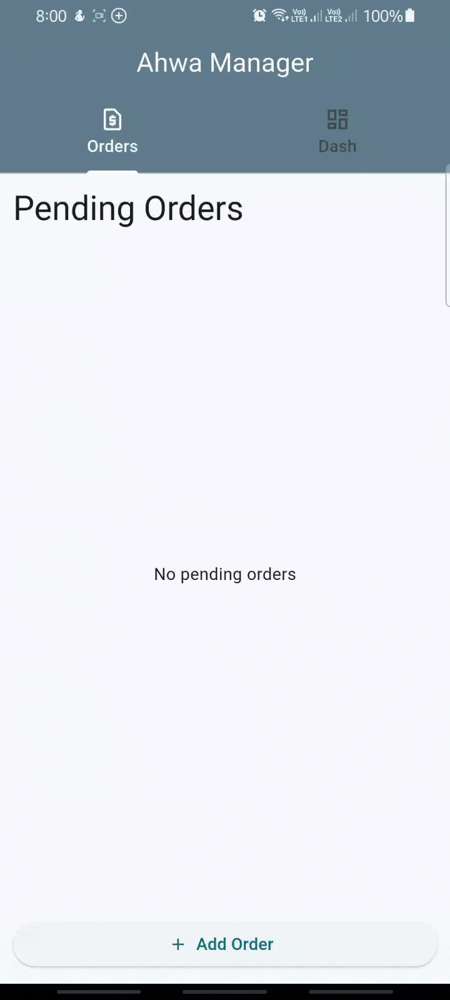

# ☕ Ahwa Manager

Ahwa Manager is a simple **Flutter application** for managing café orders.  
It demonstrates the use of **Object-Oriented Programming (OOP)** principles such as **Abstraction, Encapsulation, Polymorphism, and Modularity**.

---

## 🎬 Demo GIF

Here's a preview of the app in action:



---

## 📌 Features

- Add new orders with customer name and selected drink (Tea or Turkish Coffee).
- Support tea variants (Regular or Mint).
- Mark orders as completed.
- View pending orders in real time.
- Dashboard to show:
  - Total Orders
  - Total Served Orders
  - Top-Selling Drinks (sorted by popularity)

---

## 🛠️ OOP Principles Applied

- **Abstraction**:  
  Defined in `IOrderRepository` and `Drink` classes, which specify contracts without exposing implementation details.

- **Encapsulation**:  
  The `Order` class hides its `_completed` field, allowing it to be updated only through `markComplete()`.

- **Polymorphism**:  
  Implemented in `Drink` subclasses (`Tea`, `TurkishCoffee`) that share the same interface but define their own pricing.

- **Modularity**:  
  Code is organized into layers:
  - `models` → Core entities (`Order`, `Drink`)
  - `repo` → Data handling (`DataOrder`)
  - `views/state` → State management (`OrderManager`)
  - `views` → UI Pages (`OrdersPage`, `DashboardPage`, `MyHomePage`)

---

## 📂 Project Structure

```
lib/
│
├── data/
│   └── order.dart            # Repository implementation
│
├── models/
│   ├── drink.dart            # Drink abstraction & subclasses
│   └── order.dart            # Order entity (encapsulation)
│
├── repo/
│   └── orderRepository.dart  # Repository contract (abstraction)
│
├── views/
│   ├── dashbordPage.dart     # Dashboard screen
│   ├── ordersPage.dart       # Orders screen
│   └── state/
│       └── manager.dart      # OrderManager (state & logic)
│
├── home.dart                 # Main navigation (Tabs)
└── main.dart                 # Entry point
```

---

## 🚀 Getting Started

### Prerequisites

- Install [Flutter SDK](https://docs.flutter.dev/get-started/install)
- Emulator or physical device

### Run the project

```bash
flutter pub get
flutter run
```

---

## 🎯 Purpose

This project was built as a demonstration of **Object-Oriented Thought Process** in Dart/Flutter, showing how OOP concepts improve flexibility, maintainability, and scalability in real applications.
